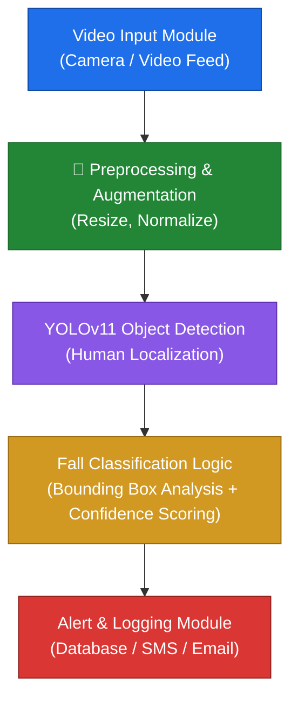

<div align="center">

# 🚨 IntelliFall

### Real-Time Human Fall Detection Using YOLO-Based Computer Vision

[](https://www.python.org/)
[](https://pytorch.org/)
[](https://docs.ultralytics.com/models/yolo11/)
[](https://opencv.org/)
[](#license)

*A real-time, deep learning–powered fall detection system built for elderly care, hospitals, and public safety monitoring.*

[Overview](#-overview) • [Architecture](#-project-architecture) • [Installation](#-installation) • [Usage](#-usage) • [Training](#-training) • [Roadmap](#-future-work)

</div>

---

## 📌 Overview

**IntelliFall** is a real-time fall detection system built on **YOLOv11**, one of the fastest and most accurate object detection architectures available. Fine-tuned on the **LE2I dataset**, the model localizes human subjects in a video stream and flags fall events with high precision and recall — enabling faster caregiver response and reduced injury risk in monitored environments.

| Capability | Description |
|---|---|
|  **Real-time inference** | Runs on live webcam or recorded video streams |
| **Fine-tuned YOLOv11** | Adapted from general object detection to fall-specific classification |
| **Low-latency alerts** | Logs and flags fall events as they happen |
| **Deployment-ready** | Designed for elderly care facilities, hospitals, and public surveillance |

---

## 💡 Motivation

Falls are one of the leading causes of injury among the elderly, and response time is critical to minimizing harm. This project exists to:

-  Improve real-time fall detection accuracy using state-of-the-art object detection
-  Provide a scalable solution deployable across healthcare and assisted-living environments
-  Serve as a foundation for multi-modal fall detection research (video + sensor + behavioral data)

---

## 🏗️ Project Architecture

The pipeline moves from raw video capture through detection to alerting in five stages:



| Module | Role |
|---|---|
| **Video Input** | Captures real-time feed from cameras or file input |
| **Preprocessing** | Resizes, normalizes, and augments incoming frames |
| **YOLOv11 Detection** | Localizes humans with bounding boxes |
| **Fall Classification** | Analyzes box geometry, motion, and confidence to flag falls |
| **Alert/Logging** | Persists events and triggers notifications |

---

## 📊 Datasets

### LE2I Dataset
Real-life fall scenarios recorded from multiple camera angles, with annotated fall and non-fall activity — used to fine-tune YOLOv11 for the variability of real fall events.

🔗 [LE2I Dataset on Roboflow](https://universe.roboflow.com/le2iahlam/le2i-ahlam/model/1)

### Supplementary Datasets
| Dataset | Type | Use Case |
|---|---|---|
| IMVIA Fall Detection Dataset | Sensor-based | Multi-modal fusion research |
| UCF Fall Detection Dataset | Video | Simulated falls across varied environments |

---

## 🧠 Model Details

| Loss Component | Purpose |
|---|---|
| **Box Loss (CIoU/GIoU)** | Optimizes bounding box regression accuracy |
| **Class Loss (BCE/Focal)** | Ensures correct fall vs. non-fall classification |
| **Distribution Focal Loss (DFL)** | Refines localization via probability distribution over box coordinates |

Fine-tuning adapts YOLOv11's general-purpose detection weights to the specialized task of identifying fall postures and motion patterns from the LE2I dataset.

---

## ⚙️ Installation

### Prerequisites
-  Python 3.7+
-  PyTorch (version matching your YOLO build)
-  OpenCV
-  Remaining dependencies in `requirements.txt`

### Setup

```bash
# 1. Clone the repository
git clone https://github.com/yourusername/intellifall.git
cd intellifall

# 2. Create a virtual environment
python -m venv venv
source venv/bin/activate      # Windows: venv\Scripts\activate

# 3. Install dependencies
pip install -r requirements.txt
```

**Download pre-trained weights** from [Ultralytics YOLOv11](https://docs.ultralytics.com/models/yolo11/) and place them in `./weights/`.

---

## 🚀 Usage

### Real-Time Detection (Webcam)
```bash
python detect.py --source 0 --weights ./weights/yolo11n.pt --conf 0.4
```

### Batch Processing (Video File)
```bash
python detect.py --source path/to/video.mp4 --weights ./weights/yolo11n.pt --conf 0.4
```

### Alert Logging
Each detection event is logged with a timestamp — connect the logging module to your own database or messaging service for production alerts.

---

## 🏋️ Training

**1. Prepare your data**
Annotate in YOLO format and organize your dataset directory per the training script's expected structure.

**2. Fine-tune**
```bash
python train.py --data data.yaml --weights ./weights/yolo11.pt --epochs 50 --batch-size 16
```

**3. Monitor**
Track loss curves and metrics with TensorBoard.

---

## 📈 Evaluation

```bash
python val.py --data data.yaml --weights runs/train/exp/weights/best.pt
```

| Metric | What It Measures |
|---|---|
| Accuracy | Overall correctness of predictions |
| Sensitivity (Recall) | Ability to catch true fall events |
| Specificity | Ability to avoid false alarms |
| Precision | Reliability of positive (fall) predictions |

---

## 🔮 Future Work

- [ ]  **Multi-modal fusion** — combine video with wearable sensor data
- [ ]  **Edge deployment** — optimize for real-time inference on edge devices (Jetson, Coral)
- [ ]  **Monitoring dashboard** — web/mobile UI for live alerts and history
- [ ]  **Action recognition** — extend beyond falls to broader behavior/safety monitoring

---

## 📚 References

1. [LE2I Fall Detection Dataset](https://universe.roboflow.com/le2iahlam/le2i-ahlam/model/1)
2. [Ultralytics YOLOv11 Documentation](https://docs.ultralytics.com/models/yolo11/)
3. [YOLOv8 Reference](https://yolov8.com/)
4. Literature on Box/Class/Distribution Focal Loss and fine-tuning strategies for object detection

---

## 🙏 Acknowledgements

Thanks to the research community advancing object detection, the maintainers of the LE2I dataset and YOLO frameworks, and the advisors and collaborators who supported this project's development.

<div align="center">

---

**⭐ If this project helped you, consider giving it a star!**

</div>
